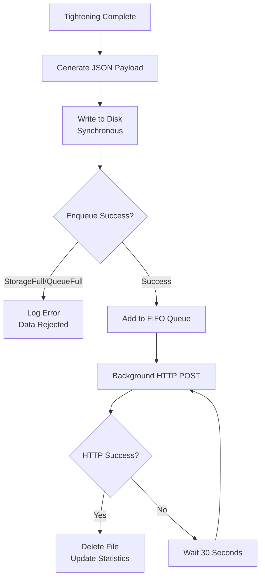

# Output Curves Export & Posting

This document explains how tightening curve data is automatically exported as JSON and posted to external systems (e.g., sys3xx gateway) via HTTP, with robust buffering to ensure zero data loss even when the target endpoint is temporarily unavailable.

## Overview

The output system provides:

- **Zero data loss guarantee**: All tightening results are persisted to disk before transmission
- **Automatic buffering**: When HTTP endpoint is unavailable, results are queued and retried automatically
- **Resilient transmission**: Indefinite retry with 30-second delay until successful delivery
- **Monitoring via DataLayer**: Buffer statistics exposed to PLC for production monitoring
- **Configurable storage**: Support for external storage devices (SD card, USB)

### Architecture



**Key principle**: Results are written to disk **synchronously** during the tightening cycle completion, ensuring no data is lost even if the application crashes or loses power immediately after a tightening.

## Configuration File: outputs.json

The `outputs.json` file controls the output and buffering behavior. It is located alongside `appdata.json` in the Solutions configuration directory:

- **Snap environment**: `$SNAP_COMMON/solutions/activeConfiguration/he-ctrlx-app-commgo/outputs.json`
- **Development environment**: `~/My Documents/My ctrlX/he-ctrlx-app-commgo/outputs.json`

### Configuration Options

| Option | Type | Default | Range | Description |
|--------|------|---------|-------|-------------|
| `EnableOutput` | bool | `false` | `true`/`false` | **Master switch**. When `false`, buffering is disabled and tool operates normally without HTTP posting. When `true`, buffering and transmission are active. |
| `OutputHttpURL` | string | (required) | Valid URL | HTTP/HTTPS endpoint for result transmission. Must be set when `EnableOutput=true`. Example: `http://127.0.0.1:8889/x` |
| `MinStorageAvailable` | int | `50` | 0-10000 | Minimum disk space in MB. Enqueue operations fail when available space drops below this threshold (error code -2). |
| `MaxItemsInQueue` | int | `200` | 1-10000 | Maximum queue capacity. Enqueue operations fail when this limit is reached (error code -4). Indicates transmission backlog. |
| `StoragePath` | string | `""` (auto) | Valid path or empty | Custom storage directory for buffered files. Empty string = automatic detection (uses `$SNAP_COMMON` in snap or `MyDocuments` in dev). External storage requires `removable-media` snap plug. |

### Configuration Examples

#### Example 1: Development/Testing (Disabled)
```json
{
  "EnableOutput": false,
  "OutputHttpURL": "http://127.0.0.1:8889/x",
  "MinStorageAvailable": 50,
  "MaxItemsInQueue": 200,
  "StoragePath": ""
}
```
With `EnableOutput: false`, the tool operates normally without buffering or HTTP posting. Useful for testing tool functionality without external dependencies.

#### Example 2: Production (Default Storage)
```json
{
  "EnableOutput": true,
  "OutputHttpURL": "http://localhost:2222/x",
  "MinStorageAvailable": 500,
  "MaxItemsInQueue": 200,
  "StoragePath": null
}
```
Standard production configuration with higher disk space threshold (500 MB) for safety margin. Uses default storage location.

#### Example 3: Production (External Storage)
```json
{
  "OutputHttpURL": "http://127.0.0.1:8889/x",
  "MinStorageAvailable": 50,
  "MaxItemsInQueue": 200,
  "StoragePath": "/media/mmcblk1p1/Buffer/CommGO",
  "_comment": "StoragePath examples - external storage requires removable-media plug:",
  "_examples": {
    "external_sd_card": "/media/mmcblk1p1/Buffer/CommGO",
    "external_usb": "/media/usb-device/outputbuffer",
    "default_snap_storage": ""
  }
}
```
Uses external SD card or USB storage. **Important**: External storage paths require the `removable-media` snap interface to be connected.

## Buffering Mechanism

### When Buffering is Triggered

The buffering system activates automatically when the HTTP endpoint is unavailable or returns errors:

- **Network connectivity issues**: Endpoint unreachable, DNS resolution failure
- **Server errors**: HTTP 4xx (client errors), 5xx (server errors)
- **Timeouts**: Request exceeds 30-second timeout limit
- **Connection refused**: Target server not listening on configured port

When any of these conditions occur, the result file remains in the queue and transmission is retried after 30 seconds.

### File Storage Format

**Naming convention**: `yyyyMMddHHmmss_GUID.json`

Example: `20260109143025_a7f3e8d1-4c2b-4f9e-9a7c-3d2e1f0b8c5a.json`

- First part: Timestamp (ensures FIFO ordering when directory is scanned)
- Second part: GUID (ensures uniqueness, prevents collisions)

**Storage locations**:

- **Snap environment**: `$SNAP_COMMON/solutions/activeConfiguration/he-ctrlx-app-commgo/OutputBuffer/`
- **Development environment**: `~/My Documents/My ctrlX/he-ctrlx-app-commgo/OutputBuffer/`
- **Custom path**: Value from `StoragePath` configuration

**File content**: Complete JSON payload (see JSON Payload Format section below)

### Retry Behavior

- **Retry delay**: 30 seconds between transmission attempts
- **Retry limit**: Unlimited (retries indefinitely until successful)
- **FIFO processing**: Oldest result transmitted first
- **Persistence**: Queue survives application restarts (directory scanned on startup to recover pending files)

### Capacity Limits

#### Storage Full Condition

**Triggers when**: Available disk space < `MinStorageAvailable` MB

**Behavior**:
- Enqueue operation returns `StorageFull` result
- File is **not written** to disk (prevents disk exhaustion)
- Error logged: "Insufficient disk space for buffer operation"
- Tool continues operating normally (tightening not blocked)

**Resolution**:
- Free disk space by deleting old files or increasing storage capacity
- Reduce `MinStorageAvailable` threshold if too conservative
- Configure `StoragePath` to external storage device with more capacity

#### Queue Full Condition

**Triggers when**: Number of pending files = `MaxItemsInQueue`

**Behavior**:
- Enqueue operation returns `QueueFull` result
- New data is **rejected** (not written to disk)
- Error logged: "Queue is at maximum capacity"
- Indicates transmission backlog (HTTP endpoint slower than tightening rate)

**Resolution**:
- Check HTTP endpoint is responsive and processing requests
- Verify network connectivity to target system
- Monitor `total_transmitted` counter in buffer statistics (should increment steadily)
- Increase `MaxItemsInQueue` temporarily if large backlog expected

## DataLayer Integration

### Curve Data Encoding

Tightening curve data is exposed in the DataLayer using an efficient integer array format: `[time_ms, torque_mNm, angle_mdeg]*`

Each curve point is represented by **3 consecutive integers** in the array:
1. **Time** (milliseconds): Time since tightening start
2. **Torque** (milli-Newton-meters): Torque value × 1000
3. **Angle** (millidegrees): Angle value × 1000

**Scaling Constants**:
- `TIME_SCALE = 1000` (seconds → milliseconds)
- `TORQUE_SCALE = 1000` (Nm → mNm, preserves 3 decimal places)
- `ANGLE_SCALE = 1000` (degrees → millidegrees, preserves 3 decimal places)

**Example**:

| Point | Time (s) | Torque (Nm) | Angle (°) | Encoded Array |
|-------|----------|-------------|-----------|---------------|
| 1 | 0.125 | 18.453 | 45.678 | `[125, 18453, 45678]` |
| 2 | 0.250 | 19.876 | 47.234 | `[250, 19876, 47234]` |
| 3 | 0.375 | 20.102 | 48.901 | `[375, 20102, 48901]` |

**Complete array**: `[125, 18453, 45678, 250, 19876, 47234, 375, 20102, 48901]`

**Decoding logic**:
```
for i = 0 to (array.length / 3) - 1:
    time_seconds = array[i * 3] / 1000.0
    torque_nm = array[i * 3 + 1] / 1000.0
    angle_degrees = array[i * 3 + 2] / 1000.0
```

### DataLayer Nodes

#### Buffer Status Node

**Path**: `he/commgo/buffer/status`

**Description**: Buffer status and statistics (updated every 15 seconds)

**Structure**:
```json
{
    "queued_items": 0,
    "total_enqueued": 0,
    "total_transmitted": 0,
    "total_failed_attempts": 0,
    "available_disk_space_mb": 0,
    "last_transmission_time": 0,
    "last_enqueue_time": 0,
    "last_time_connected": 0,
    "is_transmitting": false,
    "is_disk_space_critical": true
}
```

**Field Descriptions**:

| Field | Type | Description |
|-------|------|-------------|
| `queued_items` | int | Current number of results in buffer queue awaiting transmission |
| `total_enqueued` | long | Lifetime count of results enqueued since application start |
| `total_transmitted` | long | Lifetime count of results successfully transmitted via HTTP |
| `total_failed_attempts` | long | Lifetime count of failed HTTP transmission attempts (includes retries) |
| `available_disk_space_mb` | long | Real-time available disk space in megabytes on storage volume |
| `last_transmission_time` | long | Unix timestamp (milliseconds) of last transmission attempt (success or failure) |
| `last_enqueue_time` | long | Unix timestamp (milliseconds) of last enqueue operation |
| `last_time_connected` | long | Unix timestamp (milliseconds) of last DataLayer provider connection |
| `is_transmitting` | bool | `true` if background service is currently attempting HTTP POST |
| `is_disk_space_critical` | bool | `true` if available space < `MinStorageAvailable` threshold |

#### Tool Result Node

**Path**: `he/commgo/app/tool1/lastResult`

**Description**: Last tightening result including curve data

**Contains**: `curve_data` field with encoded integer array (format described above), `curve_point_count`, `curve_available`, `is_curve_complete` flags

### PLC Monitoring Patterns

**Healthy system indicators**:
- `queued_items` stays near zero (0-5 typically)
- `total_transmitted` increments after each tightening
- `available_disk_space_mb` > `MinStorageAvailable`
- `is_disk_space_critical` = `false`
- `total_failed_attempts` not increasing rapidly

**Unhealthy system indicators**:
- `queued_items` continuously growing (transmission backlog)
- `total_transmitted` stagnant while `total_enqueued` increments (endpoint down)
- `is_disk_space_critical` = `true` (disk full, enqueue will fail)
- `total_failed_attempts` increasing rapidly (network/endpoint issues)

**PLC monitoring logic example**:
```
IF queued_items > 50 AND (current_time - last_transmission_time) > 300000 THEN
    // Queue growing and no transmission in 5 minutes - alert operator
    RAISE_ALARM("Output buffer transmission failure")
END_IF

IF is_disk_space_critical = TRUE THEN
    // Critical disk space - stop production
    RAISE_ALARM("Output buffer storage critical")
END_IF
```

## JSON Payload Format

When a tightening completes, the application generates a comprehensive JSON payload and posts it to the configured HTTP endpoint.

### Payload Structure

The JSON contains:
- **Cycle-level metadata**: Tightening identification, timestamps, tool info, overall result
- **Tightening steps array**: One or more tightening steps (standard torque/angle control)
- **Graph data**: Separate arrays for angle, torque, and time values

### Complete Example

```json
{
  "nr": 1,
  "cycle": 818523569.441723,
  "result": "NOK",
  "channel": "GP1010003",
  "prg nr": 2,
  "prg name": "Bolt M12 Angle 45",
  "prg date": "2025-12-08T15:39:29",
  "nominal torque": 4.5,
  "date": "2025-12-08 15:39:29",
  "torque unit": "Nm",
  "last cmd": "Bolt M12 Angle 45",
  "quality code": "1",
  "total time": "0.000000",
  "tool serial": "GP1010003",
  "tightening steps": [
    {
      "result": "NOK",
      "name": "Tightening",
      "step type": "standard",
      "last cmd": "Bolt M12 Angle 45",
      "torque": 0.34,
      "angle": 47.5,
      "duration": 0,
      "quality code": "1",
      "speed": 50,
      "tightening functions": [
        {
          "name": "TF Angle",
          "nom": 45,
          "min": 30,
          "max": 59.9,
          "act": 47.5
        },
        {
          "name": "MFs TimeMax",
          "nom": 100,
          "act": 0
        },
        {
          "name": "MFs TorqueMax",
          "nom": 4.5,
          "min": 5,
          "max": 4,
          "act": 0.34
        }
      ],
      "graph": {
        "angle values": [0, 1, 2, 3, 4, 5, 6, 7, 8, 9, 10, 11, 12, 13, 14, 15, 16, 17, 18, 19, 20, 21, 22, 23, 24, 25, 26, 27, 28, 29, 30, 31, 32, 33, 34, 35, 36, 37, 38, 39, 40, 41, 42, 43, 44, 45, 46, 47],
        "torque values": [1.8, 1.5, 1.4, 1.4, 1.4, 1.2, 1.2, 1.2, 1.3, 1.1, 1.2, 1.3, 1.2, 1.1, 1, 1.1, 1.5, 1.9, 3.4, 1.5, 1.4, 1.3, 1.4, 1.2, 1.1, 1.5, 1.4, 1.4, 1.4, 1.6, 1.6, 1.9, 1.7, 1.9, 1.8, 1.9, 1.7, 1.8, 1.9, 2.1, 1.8, 2, 1.7, 1.6, 1.2, 1.3, 1.4, 1.8],
        "time values": [0, 0.01, 0.02, 0.03, 0.04, 0.049999997, 0.06, 0.07, 0.08, 0.089999996, 0.099999994, 0.11, 0.12, 0.13, 0.14, 0.14999999, 0.16, 0.17, 0.17999999, 0.19, 0.19999999, 0.21, 0.22, 0.22999999, 0.24, 0.25, 0.26, 0.26999998, 0.28, 0.29, 0.29999998, 0.31, 0.32, 0.32999998, 0.34, 0.35, 0.35999998, 0.37, 0.38, 0.39, 0.39999998, 0.41, 0.42, 0.42999998, 0.44, 0.45, 0.45999998, 0.47]
      }
    }
  ]
}
```

### Field Descriptions

#### Cycle-Level Fields

| Field | Type | Description |
|-------|------|-------------|
| `nr` | int | Sequential tightening number (increments with each cycle) |
| `cycle` | float | High-precision timestamp (seconds since epoch) |
| `result` | string | Overall tightening result: `"OK"` (passed) or `"NOK"` (failed) |
| `channel` | string | Tool identifier/serial number (e.g., `"GP1010003"`) |
| `prg nr` | int | Parameter set (Pset) number used (1-based index) |
| `prg name` | string | Human-readable Pset name (e.g., `"Bolt M12 Angle 45"`) |
| `prg date` | string | Pset last modified date (ISO 8601 format) |
| `nominal torque` | float | Target torque value from Pset (in `torque unit`) |
| `date` | string | Tightening completion timestamp (local time) |
| `torque unit` | string | Unit of measurement for torque values (e.g., `"Nm"`) |
| `last cmd` | string | Last command sent to tool (typically Pset name) |
| `quality code` | string | Quality/status code (tool-specific encoding) |
| `total time` | string | Total tightening duration (seconds, may be `"0.000000"` for GWK Operator) |
| `tool serial` | string | Tool serial number (duplicates `channel` for compatibility) |

#### Tightening Steps Array

Each step represents a phase of the tightening process (GWK Operator typically has one step):

| Field | Type | Description |
|-------|------|-------------|
| `result` | string | Step result: `"OK"` or `"NOK"` |
| `name` | string | Step name (e.g., `"Tightening"`) |
| `step type` | string | Step type (e.g., `"standard"`) |
| `last cmd` | string | Command associated with this step |
| `torque` | float | Final torque achieved (Nm) |
| `angle` | float | Final angle achieved (degrees) |
| `duration` | float | Step duration (seconds) |
| `quality code` | string | Step-level quality code |
| `speed` | int | Tightening speed setting (RPM or %) |

#### Tightening Functions Array

Monitoring functions (tightening criteria) evaluated during the step:

| Field | Type | Description |
|-------|------|-------------|
| `name` | string | Function name (e.g., `"TF Angle"`, `"MFs TorqueMax"`) |
| `nom` | float | Nominal (target) value |
| `min` | float | Minimum acceptable value (optional) |
| `max` | float | Maximum acceptable value (optional) |
| `act` | float | Actual measured value |

#### Graph Object

Real-time curve data captured during tightening (three parallel arrays):

| Field | Type | Description |
|-------|------|-------------|
| `angle values` | int[] | Angle progression in integer degrees (0°, 1°, 2°, ...) |
| `torque values` | float[] | Torque measurements in Nm at each angle (same length as `angle values`) |
| `time values` | float[] | Elapsed time in seconds at each angle (same length as `angle values`) |

**Note**: Array indices correspond - `angle values[i]`, `torque values[i]`, and `time values[i]` represent the same measurement point.

## sys3xx Gateway Integration

To integrate with sys3xx gateway:

1. **Configure sys3xx gateway** to listen on an HTTP endpoint (e.g., `http://127.0.0.1:8889/x`)
2. **Set `OutputHttpURL`** in `outputs.json` to point to the gateway endpoint
3. **Enable output** by setting `EnableOutput: true`
4. **Restart application** to apply configuration changes
5. **Verify transmission** by monitoring `he/commgo/buffer/status` node or checking gateway logs

The sys3xx gateway should accept HTTP POST requests with `Content-Type: application/json` containing the payload structure described above.

## Troubleshooting

### No Data Received at sys3xx

**Symptoms**: sys3xx gateway not receiving tightening data

**Checks**:
1. Verify `EnableOutput: true` in `outputs.json`
2. Verify `OutputHttpURL` points to correct gateway endpoint
3. Check gateway is running and listening on configured port
4. Test endpoint connectivity: `curl -X POST http://127.0.0.1:8889/x -d '{"test": true}'`
5. Check `he/commgo/buffer/status` node:
   - Is `total_enqueued` incrementing? (If no, buffering disabled or file write failing)
   - Is `total_transmitted` incrementing? (If no, HTTP POST failing)
   - Is `queued_items` growing? (If yes, endpoint unreachable or slow)

**Resolution**:
- Fix `OutputHttpURL` if incorrect
- Ensure sys3xx gateway is accessible from ctrlX CORE device
- Check firewall rules allow HTTP traffic on configured port
- Review application logs for HTTP error codes

### Storage Full Errors

**Symptoms**: Error code -2 (`NoStorageAvailable`), enqueue operations failing, `is_disk_space_critical: true` in buffer status

**Checks**:
1. Check `available_disk_space_mb` in `he/commgo/buffer/status` node
2. Compare against `MinStorageAvailable` setting (default 50 MB)
3. Check storage path exists and is writable:
   - Snap: `$SNAP_COMMON/solutions/activeConfiguration/he-ctrlx-app-commgo/OutputBuffer/`
   - Custom: Value from `StoragePath`
4. For external storage, verify snap has `removable-media` interface connected

**Resolution**:
- Free disk space by deleting old files or increasing storage capacity
- Reduce `MinStorageAvailable` threshold if too conservative (e.g., change to 20 MB)
- Configure `StoragePath` to external storage device (SD card/USB) with more capacity
- Connect `removable-media` snap plug: `snap connect he-ctrlx-app-commgo:removable-media`

### Queue Full Errors

**Symptoms**: Error code -4 (`MaxBufferLimitReached`), enqueue operations failing, `queued_items` = `MaxItemsInQueue`

**Checks**:
1. Check `queued_items` in `he/commgo/buffer/status` node
2. Compare against `MaxItemsInQueue` setting (default 200)
3. Check `total_transmitted` is incrementing:
   - If **stagnant**: HTTP endpoint down or unreachable
   - If **incrementing slowly**: Endpoint processing slower than tightening rate
4. Check `total_failed_attempts` increasing:
   - If **yes**: Network or endpoint errors (check logs for HTTP status codes)

**Resolution**:
- **Immediate**: Increase `MaxItemsInQueue` temporarily (e.g., to 500) to prevent data loss
- **Root cause**: Fix HTTP endpoint connectivity/availability
  - Test endpoint: `curl -X POST http://127.0.0.1:8889/x -d '{"test": true}'`
  - Check gateway logs for errors or performance issues
  - Verify network connectivity between ctrlX and gateway
- **Long-term**: Ensure endpoint can handle tightening rate (e.g., 1 tightening/second)

### Enable Command Blocked by Output Errors

**Symptoms**: Enable command returns error code -2 or -4, tool cannot be enabled

**Checks**:
1. Check `outputs.json` configuration is valid
2. Check `EnableOutput` setting:
   - If `false`: Output errors should not block Enable
   - If `true`: Storage must be available and queue not full
3. Check buffer status for critical conditions

**Resolution**:
- **Quick workaround**: Set `EnableOutput: false` to disable output system (tool will operate normally)
- **Proper fix**: Resolve storage/queue issues (see above sections)
- After fixing, restart application to clear error state

### Buffer Statistics Interpretation

**Healthy production system** (example values):
```json
{
    "queued_items": 2,                    // Small queue backlog (normal)
    "total_enqueued": 15234,              // Lifetime count
    "total_transmitted": 15232,           // Almost all transmitted
    "total_failed_attempts": 47,          // Few failures (retries)
    "available_disk_space_mb": 8450,      // Plenty of space
    "last_transmission_time": 1736429845000,  // Recent activity
    "is_transmitting": true,              // Active transmission
    "is_disk_space_critical": false       // Space OK
}
```

**Unhealthy system** (example values):
```json
{
    "queued_items": 198,                  // Queue nearly full (critical!)
    "total_enqueued": 8567,               // Lifetime count
    "total_transmitted": 8369,            // 198 pending (queued_items)
    "total_failed_attempts": 2341,        // Many failures (endpoint issues)
    "available_disk_space_mb": 35,        // Low space (approaching threshold)
    "last_transmission_time": 1736429515000,  // 5+ minutes ago (stalled)
    "is_transmitting": false,             // Not transmitting (bad sign)
    "is_disk_space_critical": true        // Critical space condition
}
```

**Action required**:
- `queued_items > 100`: Investigate HTTP endpoint, consider increasing `MaxItemsInQueue`
- `is_disk_space_critical = true`: Free space or configure external storage
- `total_failed_attempts` rapidly increasing: Check network/endpoint logs for HTTP errors
- `last_transmission_time` > 5 minutes old: Verify endpoint is running and accessible

### Error Code Reference

For complete list of error codes that may appear in buffer status or Enable/Disable operations, see [Error Codes Reference](./error-codes.md).
