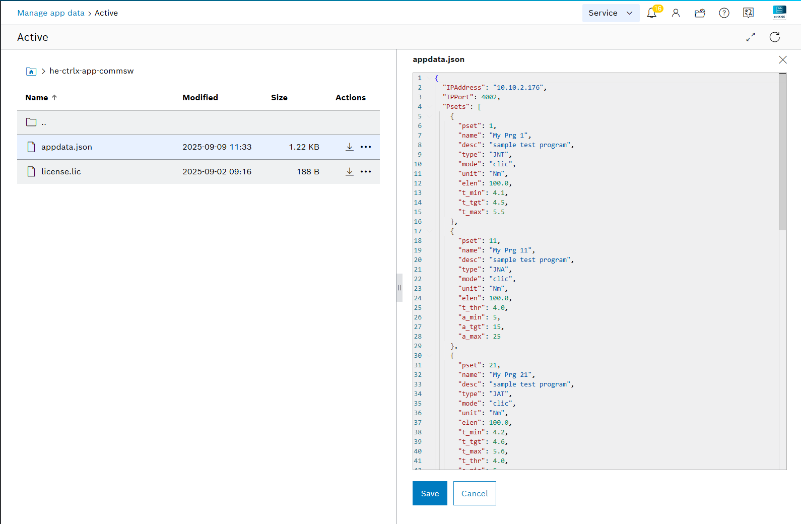
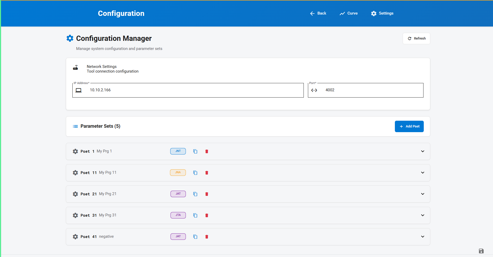
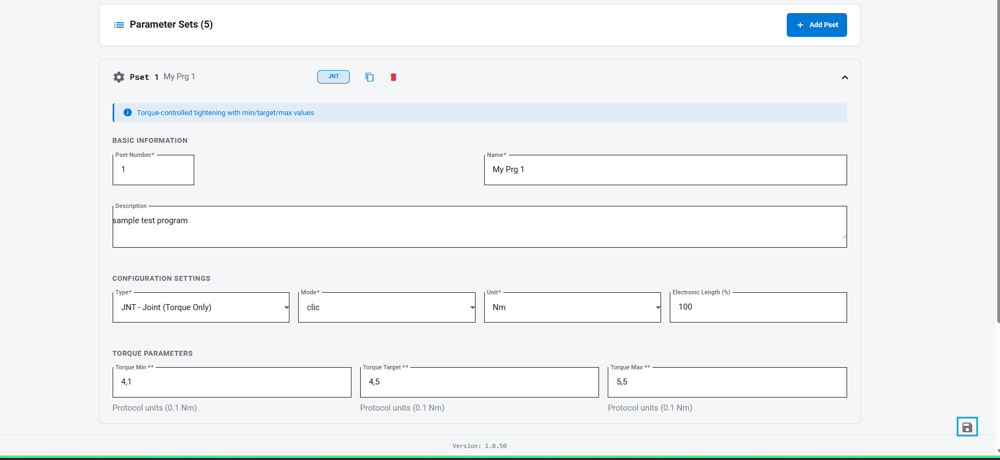

## Location
Solutions file view:
```
…/solutions/configurations/appdata/content/edit/appdata.json?path=he-ctrlx-app-commsw%2F
```

## Required Fields
`IPAddress`, `IPPort`, `PSets` (array of program definitions).

Supported PSet fields: `pset`, `name`, `desc`, `type` (JNT/JNA/JTA/JAT), `mode` (clic/trck/peak), `unit` (Nm/in lb/ft lb), `elen`, torque limits `t_min/t_tgt/t_max`, threshold `t_thr`, and angle `a_min/a_tgt/a_max` where applicable.

### Parameter applicability by tool type

| Parameter | Description        | JNT | JNA | JTA | JAT |
|-----------|--------------------|:---:|:---:|:---:|:---:|
| `t_min`   | Minimum torque      | ✓ |   | ✓ | ✓ |
| `t_tgt`   | Target torque       | ✓ |   | ✓ | ✓ |
| `t_max`   | Maximum torque      | ✓ |   | ✓ | ✓ |
| `t_thr`   | Threshold torque    |   | ✓ | ✓ | ✓ |
| `a_min`   | Minimum angle       |   | ✓ | ✓ | ✓ |
| `a_tgt`   | Target angle        |   | ✓ | ✓ | ✓ |
| `a_max`   | Maximum angle       |   | ✓ | ✓ | ✓ |

Blank cells indicate the parameter is not used for that tool type.

## Example
```json
{
  "IPAddress": "10.10.2.168",
  "IPPort": 4002,
  "PSets": [
    {
      "pset": 1,
      "name": "My Prg 1",
      "desc": "sample test program",
      "type": "JNT",
      "mode": "clic",
      "unit": "Nm",
      "elen": 100.0,
      "t_min": 4.1,
      "t_tgt": 4.5,
      "t_max": 5.5
    }
  ]
}
```



## Configuration Editor UI

The application includes a Graphical User Interface to modify the configuration of the network settings and parameter sets directly without editing the JSON file manually.

### Overview Page
The main configuration page displays the current network connection settings (IP Address and Port) and a list of all configured parameter sets (PSets).



### Parameter Set Editor
Expanding a parameter set displays its specific configuration settings, such as PSet number, name, description, unit, and torque/angle parameters.


