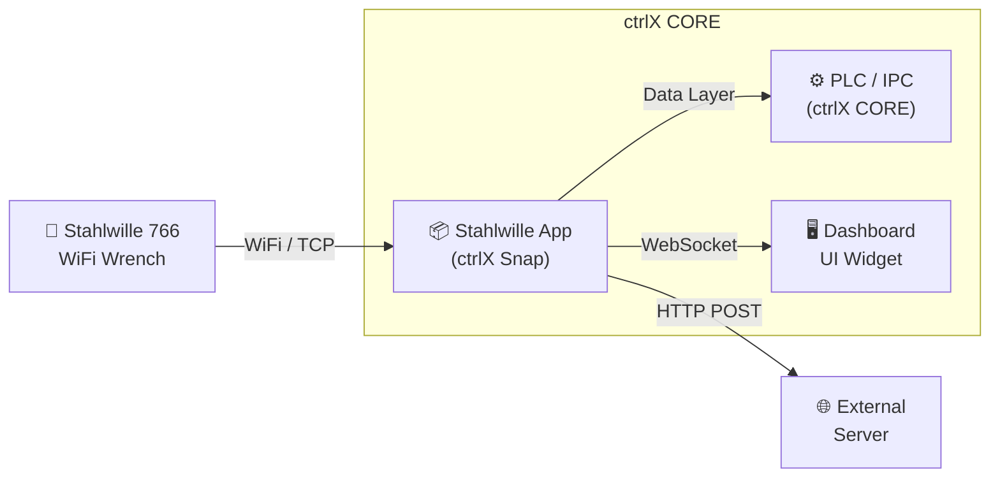

> This is the entry point. Sub‑sections cover installation, configuration (`appdata.json`), applying changes, UI/widget usage, Data Layer control, licensing, troubleshooting, and quick reference.

## Purpose
Integrate a STAHLWILLE wrench with ctrlX over Wi‑Fi, provide a dashboard widget, and expose control/status through the Data Layer (single‑cycle enable behavior and result reporting).

## Platform
Tested on ctrlX OS V3.6.2 (arm64 snap for Core X3, amd64 snap for Core X7).

**Data flow:**
- **Tool → App**: WiFi connection, receives tightening results and tool status
- **App → Data Layer**: Exposes `command` (PSet + enable), `state`, and `lastResult` nodes at `he/commsw/app/tool1`
- **App → Widget**: Real-time updates via WebSocket push
- **App → Server**: Output curves posted via HTTP (configurable endpoint)

## Sections
- [Installation](./installation.md)
- [Configuration (`appdata.json`)](./configuration.md)
- [Applying changes (restart flow)](./applying-changes.md)
- [UI & Widget usage](./ui-widget.md)
- [Data Layer control](./data-layer.md)
- [Licensing](./licensing.md)
- [Troubleshooting](./troubleshooting.md)
- [Quick reference](./quick-reference.md)

Proceed in order if you are new; jump directly to Configuration or Data Layer once familiar.

